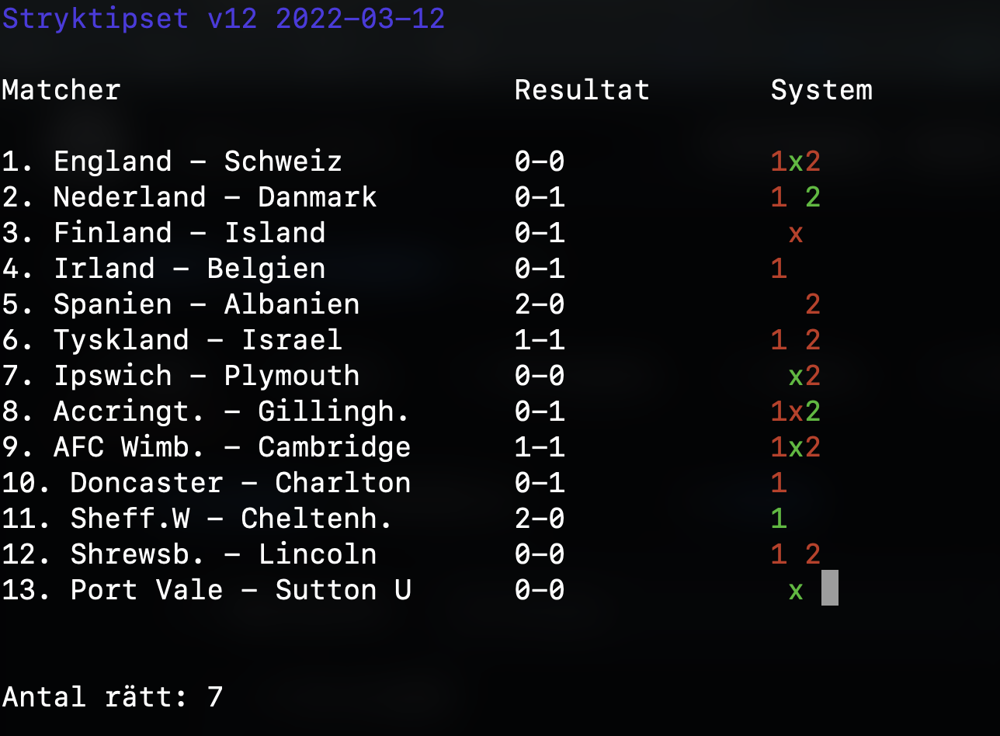

# cli-stryktet

CLI for the popular swedish betting game [Stryktipset](https://spela.svenskaspel.se/stryktipset)

Enter your system rows and let the CLI correct it for you, live!

The CLI is built using the curses python library which supplies a terminal-independent screen-painting and keyboard-handling facility for text-based terminals.



## Installation

```bash
python3 -m venv venv
source venv/bin/activate

pip3 install -r requirements.txt

```
## How to run

```
cd cli-stryket
python3 cli-stryket.py system.txt`
```

`system.txt` is the file containing your system. 

Example `system.txt` : 

```
1x
1x2
12
x
1
2
12
1x2
1x
x2
x
2
x2
```

## How does it work?

TODO
